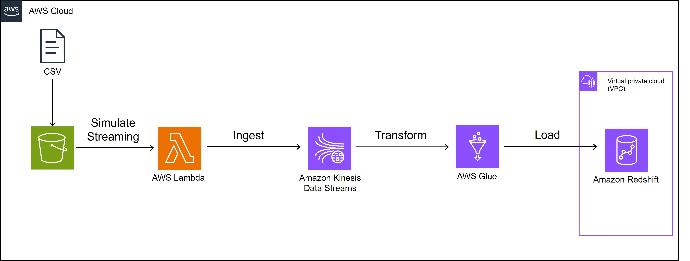

# Building Ingest-Transform-Load Streaming Pipeline         

## About Kinesis:
### Data ingestion
In Kinesis Data Streams, the producers are the source where the data is produced. The data is continuously pushed from producers into Kinesis Data Stream where the data is distributed across shards based on a partition key. Shards is a unit of capacity in stream, and each shard can ingest up to 1MB of data/sec. Producer specified the partition key.

### Data storage
When data ingested into stream, it becomes Records that consist of Data Blob (actual data), Partition key, and Sequence Number (ID to track down data). Records are stored in shards for 24 hours to 7 days. The stream is replicated across AWS availability zones, making it durable and fault tolerant.

### Data Processing and Output
Consumers read records from shards and apply transformation and analytics. The consumers can use any custom application on Amazon EC2 (AWS Lambda or Kinesis Data Analytics or AWS Firehose) and send out to another application or Amazon DynamoDB, Redshift, or S3 to store data permanently.

## Objective of the project:
Problem that I am attempting to solve:
The problem that I am trying to solve is when streaming data in real time that is high in volume and high in velocity, it is hard to handle the ingestion process that is fault tolerant. In my demo, the problem that I am attempting to solve is how to build a fault tolerant ingestion-transform-load of many baseball players in the MLB to record their statistics everyday in the form of streaming data during the season and store it in the data warehouse. We can use kinesis stream to partition statistics by each player to each shard which makes it more scalable and efficient to ingest stream data with low latency and high throughput.    

### What am I trying to build:
I am trying to build an ingest-transform-load streaming pipeline for baseball player statistics by extracting the data from the official MLB website, ingesting it with Amazon Kinesis, transform with Glue, and load to Amazon Redshift Data warehouse.

### What do you plan to demonstrate in demo:
I am taking statistics of 3 LA dodger baseball players, Shohei Ohtani, Betts Mookie, and Freddie Freeman, in the duration of 3 months and making a simulation of streaming of the data from the csv in the S3 bucket. Then, I will use lambda to stream each record to the Kinesis Data Streaming. After ingestion, the data will be transformed in Glue by selecting only the important statistics. After that, data will be loaded into a warehouse, Amazon redshift. 

### The technology or the technologies you plan to use for your project (for example: EC2,
S3 and CloudFront).
S3, Amazon Kinesis, Lambda function, Glue, Redshift, Cloudwatch

